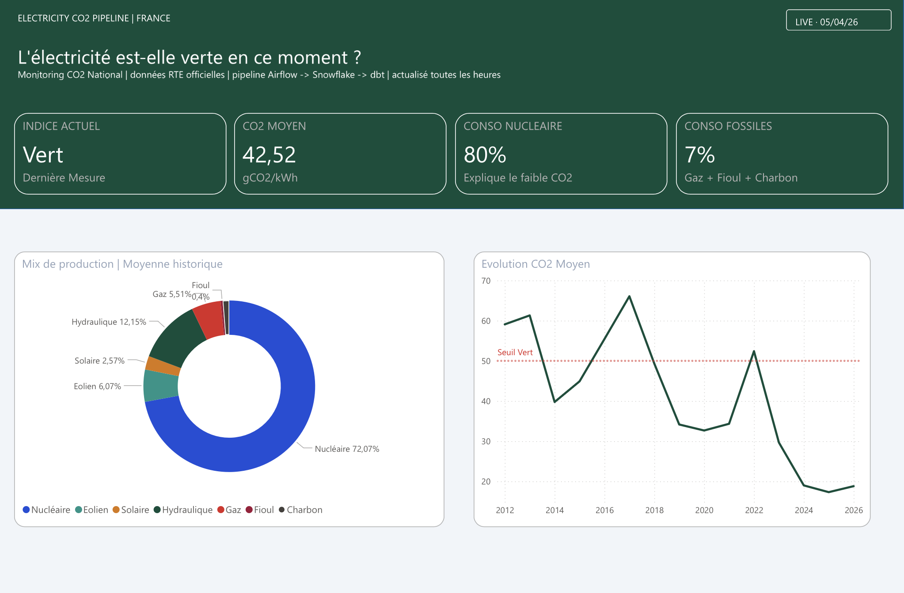
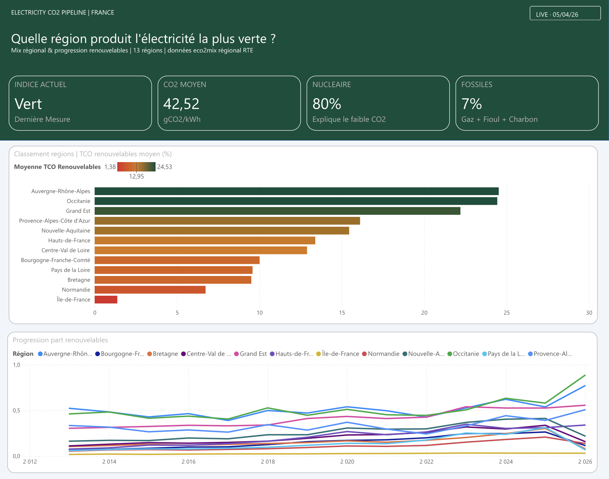
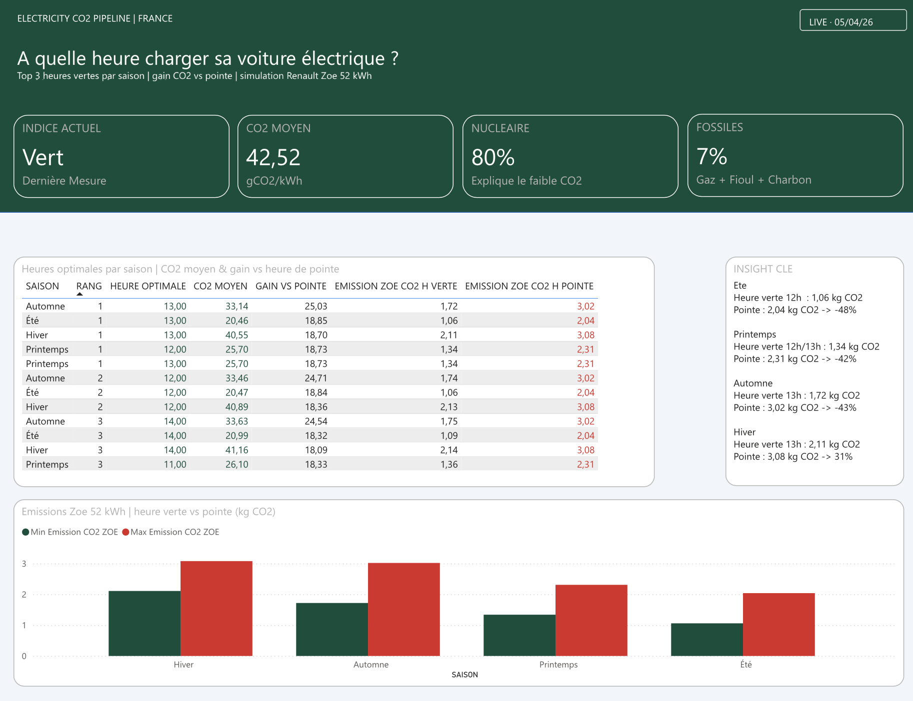
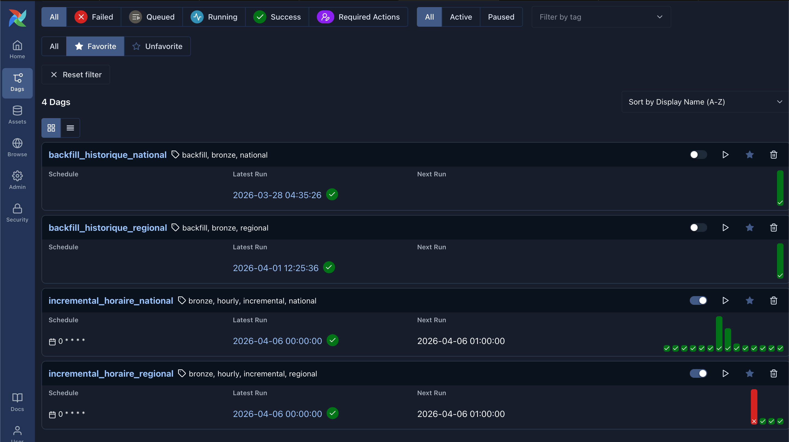
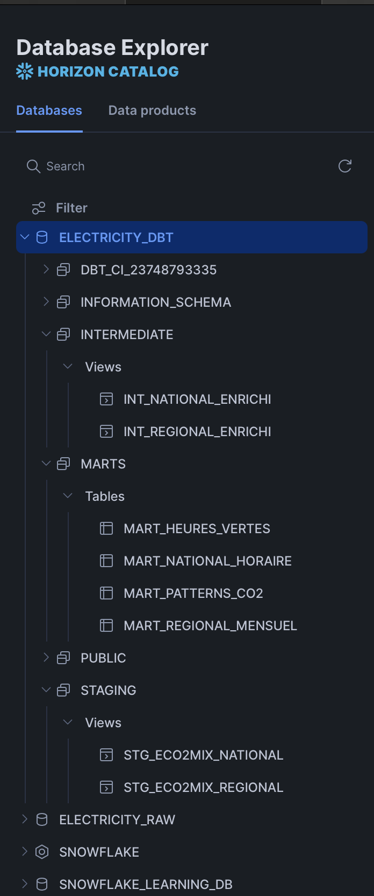

# Electricity CO2 Pipeline

Pipeline de données sur l'empreinte carbone de l'électricité française.  
"En été, charger sa voiture électrique à 12h plutôt qu'en soirée, c'est 48% de CO2 en moins."

---

## C'est quoi ce projet ?

J'ai construit un pipeline end-to-end qui répond à une question simple : quand et où l'électricité française est-elle vraiment verte ?

Les données viennent directement de l'API officielle RTE éco2mix — des mesures réelles au pas de 30 minutes depuis 2012, mises à jour toutes les heures via un DAG Airflow.

---

## Stack

 Outil & Rôles

**Apache Airflow** | Orchestration des DAGs |
**Snowflake** | Data Warehouse |
**dbt Core** | Transformation & tests |
**Power BI Service** | Dashboard live |
**Docker** | Environnement local |

---

## Architecture

RTE éco2mix API → Airflow (4 DAGs) → Snowflake Bronze → dbt → Power BI

---

## Dashboard Power BI

Page 1 — L'électricité est-elle verte en ce moment ?
42.52 gCO2/kWh ce soir → Indice Vert
Ce qui est frappant dans les données annuelles : la France a divisé son CO2 électrique par 3.8 en 10 ans — de 61 gCO2/kWh en 2013 à 17 gCO2/kWh en 2025.

Page 2 — Quand l'électricité est-elle la plus verte ?
Printemps = la saison la plus verte : 34-37 gCO2/kWh quelle que soit l'heure
Hiver = la plus carbonée : 48-54 gCO2/kWh
L'heure compte moins que la saison et la nuit n'est pas toujours verte.

Page 3 — Quelle région produit l'électricité la plus verte ?
Auvergne-Rhône-Alpes #1
Île-de-France dernière : ne produit presque rien, importe tout du réseau national
Tendance 2012-2026 : toutes les régions progressent, mais Occitanie et Nouvelle-Aquitaine ont la pente la plus forte

Page 4 — À quelle heure charger sa voiture électrique ?
13h est systématiquement la meilleure heure dans 3 saisons sur 4 — c'est le pic solaire qui tire le CO2 vers le bas. En hiver le soleil est trop faible pour faire la différence, donc le gain est plus modeste.

---

## Pipeline & infrastructure

Airflow — 4 DAGs

Snowflake — Architecture médaillon

---

## Modèles dbt

- `staging/` — nettoyage et typage des données brutes
- `intermediate/` — enrichissement temporel et calcul des KPIs CO2
- `marts/` — tables analytiques prêtes pour Power BI

245 638 lignes · 2012 → live · 37 tests · CI/CD GitHub Actions

---

## Lancer le projet

Cloner
git clone https://github.com/antvng/Electricity-co2-pipeline.git
cd Electricity-co2-pipeline

Configurer les credentials
cp .env.example .env

Lancer Airflow
cd docker && docker compose up -d

Installer dbt et lancer les modèles
python -m venv .venv && source .venv/bin/activate
pip install dbt-snowflake==1.8.0
cd dbt && dbt run && dbt test